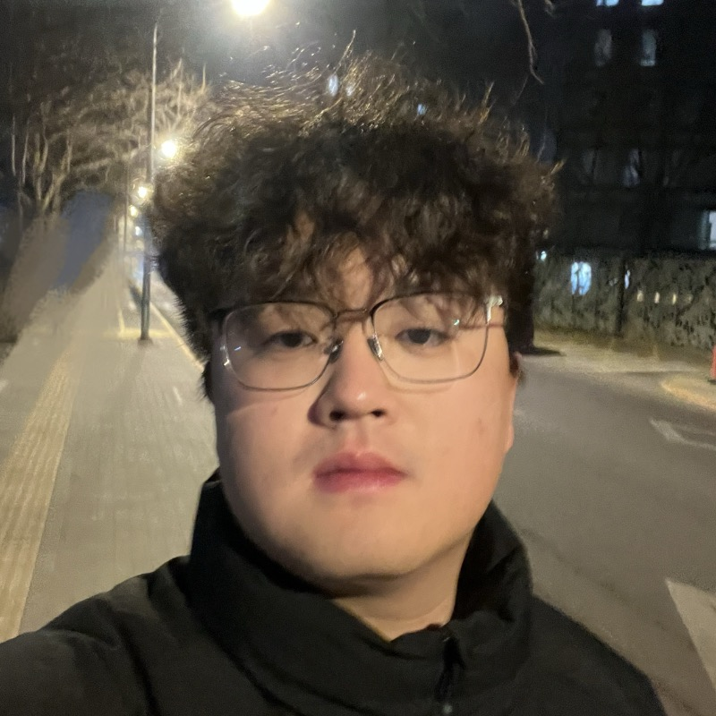

I am a recommendation algorithm engineer at KuaiShou.

<!--Previously, I obtained my PhD from Princeton University advised by [Karthik Narasimhan](https://www.cs.princeton.edu/~karthikn/), and my bachelor's from Yao Class at Tsinghua University.
-->
I study LLM4Rec and recommendation algorithms.

<!--
In my work, I study agents.

In my life, I read, travel, rap, and play basketball.
-->
<!-- - To anyone: give me [feedback](https://www.admonymous.co/ysymyth) about anything! -->

<!--I dedicate 30 minutes per week to chat with students. Just paper plane me!  -->

<!---
# Recent News
- Sep 2023: Excited to release 🐨[CoALA](https://arxiv.org/abs/2309.02427), a systematic framework for language agents! Summary [here](https://twitter.com/ShunyuYao12/status/1699396834983362690).
- Aug 2023: I gave a [talk](https://www.bilibili.com/video/BV1ju4y1e7Em) in Chinese about ReAct, Reflexion, ToT, WebShop, InterCode, Collie. Slides [here](https://ysymyth.github.io/papers/from_language_models_to_language_agents.pdf).
- Jul 2023: I enjoyed teaching at [Princeton AI4ALL](https://ai4all.princeton.edu)! Coverage [here](https://www.today.com/video/how-the-summer-program-ai4all-is-helping-reshape-the-future-189707845651).
- Jul 2023: I wrote a [blog post](https://princeton-nlp.github.io/language-agent-impact/) with Karthik about opportunities and risks of language agents! Comment [here](https://twitter.com/ShunyuYao12/status/1683827766104408066).
<!---- Apr 2023: I attended LangChain's Agent [webinar](https://www.youtube.com/watch?v=1gRlCjy18m4). Summary [here](https://twitter.com/jh_damm/status/1646233627661828109).   -->

# Education

- **Xi'an Jiaotong University**  
  **Master's degree**, AI, 2022.9 - 2025.6 
  During both my first and second years of graduate studies, I received the top scholarship (awarded to the top 2%) at Xi'an Jiaotong University.

- **Zhengzhou University**  
  **Bachelor's degree**, Software Engineering, 2018.9 - 2022.6  
  Four-year GPA: 3.5/4 (Major ranking: 9/184, top 4.89%) CET-6: 501  CET-4: 545  IELTS: 6.5 (Overall score)

# Experience
- **Kuaishou Technology Co., Ltd.**  
  Recommendation Algorithm Engineer, June 2025 - Present

- **Tencent Technology Co., Ltd.** (Internship)  
  Recommendation Algorithm Engineer, May 2024 - August 2024

- **Momenta Technology Co., Ltd.** (Internship)  
  System Architecture and Integration Engineer, February 2024 - May 2024

- **vivo Mobile Communication Co., Ltd.** (Internship)  
  Image Algorithm Engineer, November 2023 - January 2024

# Papers

- **Beyond Single-Modal Boundary: Cross-Modal Anomaly Detection through Visual Prototype and Harmonization**  
  Kai Mao, *Ping Wei, Yiyang Lian, Yangyang Wang, Nanning Zheng  
  CVPR 2025  
  Anomaly detection is a significant task for its application and research value. While existing methods have made impressive progress within the same modality, cross-modal anomaly detection remains an open and challenging prob lem. In this paper, we propose a cross-modal anomaly detection model that is trained using data from a variety of existing modalities and can be generalized well to unseen modalities. The model consists of three major components: 1) the Transferable Visual Prototype directly learns nor mal/abnormal semantics in visual space; 2) the Prototype Harmonization strategy adaptively utilizes the Transferable Visual Prototypes from various modalities for inference on the unknown modality; 3) the Visual Discrepancy Inference under the few-shot setting enhances performance.  
    [paper](https://openaccess.thecvf.com/content/CVPR2025/papers/Mao_Beyond_Single-Modal_Boundary_Cross-Modal_Anomaly_Detection_through_Visual_Prototype_and_CVPR_2025_paper.pdf)

- **Unveiling Multi-View Anomaly Detection: Intra-view Decoupling and Inter-view Fusion**  
  Kai Mao, Yiyang Lian, Yangyang Wang, Meiqin Liu, Nanning Zheng, *Ping Wei  
  AAAI 2025  
  Anomaly detection has garnered significant attention for its extensive industrial application value. Most existing methods focus on single-view scenarios and fail to detect anomalies hidden in blind spots, leaving a gap in addressing the demands of multi-view detection in practical applications. Ensemble of multiple single-view models is a typical way to tackle the multi-view situation, but it overlooks the correlations between different views. In this paper, we propose a novel multi-view anomaly detection framework, Intra-view Decoupling and Inter-view Fusion (IDIF), to explore correlations among views. Our method contains three key components: 1) a proposed Consistency Bottleneck module extracting the common features of different views through information compression and mutual information maximization; 2) an Implicit Voxel Construction module fusing features of different views with prior knowledge represented in the form of voxels; and 3) a View-wise Dropout training strategy enabling the model to learn how to cope with missing views during test. The proposed IDIF achieves state-of-the-art performance on three datasets. Extensive ablation studies also demonstrate the superiority of our methods.  
    [paper](https://ojs.aaai.org/index.php/AAAI/article/download/33349/35504)

- **CSDD: A Benchmark Dataset for Casting Surface Defect Detection and Segmentation**  
  Kai Mao, Yiyang Lian, Yangyang Wang, Meiqin Liu, Nanning Zheng, *Ping Wei  
  JAS 2025, SCI Q1, IF 19.2  
  Automatic surface defect detection is a critical technique for ensuring product quality in industrial casting production. While general object detection techniques have made remarkable progress over the past decade, casting surface defect detection still has considerable room for improvement. Lack of sufficient and high-quality data has become one of the most challenging problems for casting surface defect detection. In this paper, we construct a new casting surface defect dataset (CSDD) containing 2100 high-resolution images of casting surface defects and 56 356 defects in total. The class and defect region for each defect are manually labeled. We conduct a series of experiments on this dataset using multiple state-of-the-art object detection methods, establishing a comprehensive set of baselines. We also propose a defect detection method based on YOLOv5 with the global attention mechanism and partial convolution. Our proposed method achieves superior performance compared to other object detection methods. Additionally, we also conduct a series of experiments with multiple state-of-the-art semantic segmentation methods, providing extensive baselines for defect segmentation. To the best of our knowledge, the CSDD has the largest number of defects for casting surface defect detection and segmentation. It would benefit both the industrial vision research and manufacturing applications.  
    [paper](https://ieeexplore.ieee.org/abstract/document/11005751/)

    
<!--- **Embers of Autoregression: Understanding Large Language Models Through the Problem They are Trained to Solve**  
    R. Thomas McCoy, Shunyu Yao, Dan Friedman, Matthew Hardy, Thomas L. Griffiths  
    [paper](https://arxiv.org/abs/2309.13638) |
    [repo](https://github.com/tommccoy1/embers-of-autoregression) |
    [tweet](https://twitter.com/RTomMcCoy/status/1706664506913399198)
   -->

<!---- **Referral Augmentation for Zero-Shot Information Retrieval**  
    Michael Tang, Shunyu Yao, John Yang, Karthik Narasimhan  
    [paper](https://arxiv.org/abs/2305.15098) |
    [repo](https://github.com/michaelwilliamtang/referral-augment) |
    [tweet](https://twitter.com/ShunyuYao12/status/1661340889724100611)
   -->
   
<!-- - **Collie: Systematic Construction of Constrained Text Generation Tasks**  
    Shunyu Yao\*, Howard Chen\*, Austin Wang\*, Runzhe Yang\*, Karthik Narasimhan  
    [paper](https://arxiv.org/abs/2307.08689) |
    [repo](https://github.com/princeton-nlp/Collie) |
    [tweet](https://twitter.com/ShunyuYao12/status/1681315647018663936) |
    [project](https://collie-benchmark.github.io)
   -->

<!-- - **TVShowGuess: Character Comprehension in Stories as Speaker Guessing**  
    Yisi Sang\*, Xiangyang Mou\*, Mo Yu\*, Shunyu Yao, Jing Li, Jeffrey Stanton  
    NAACL 2022  
    [paper](https://arxiv.org/abs/2204.07721)  | 
    [code](https://github.com/YisiSang/TVSHOWGUESS)
 -->

<!-- - **Linking Emergent and Natural Languages via Corpus Transfer**  
    Shunyu Yao, Mo Yu, Yang Zhang, Karthik Narasimhan, Joshua Tenenbaum, Chuang Gan  
    ICLR 2022 (Spotlight)  
    [paper](http://arxiv.org/abs/2203.13344) | 
    [code](https://github.com/ysymyth/ec-nl) |
    [tweet](https://twitter.com/ShunyuYao12/status/1518774718639181824)
 -->
<!-- 
- **Multi-Stage Episodic Control for Strategic Exploration in Text Games**  
    Jens Tuyls, Shunyu Yao, Sham Kakade, Karthik Narasimhan  
    ICLR 2022 (Spotlight)  
    [paper](https://arxiv.org/abs/2201.01251) | 
    [code](https://github.com/princeton-nlp/XTX) | 
    [project](https://sites.google.com/princeton.edu/xtx)

 -->
<!--  - **Self-Attention Networks Can Process Bounded Hierarchical Languages**  
    Shunyu Yao, Binghui Peng, Christos Papadimitriou, Karthik Narasimhan  
    ACL 2021  
    [paper](https://arxiv.org/abs/2105.11115) | 
    [code](https://github.com/princeton-nlp/dyck-transformer) |
    [tweet](https://twitter.com/ShunyuYao12/status/1397047887763099650) | 
    [AI2 NLP Highlights Podcast](https://soundcloud.com/nlp-highlights/129-transformers-and-hierarchical-structure-with-shunyu-yao?utm_source=allenai.org&utm_campaign=wtshare&utm_medium=widget&utm_content=https%253A%252F%252Fsoundcloud.com%252Fnlp-highlights%252F129-transformers-and-hierarchical-structure-with-shunyu-yao) -->
    

<!--  - **Reading and Acting while Blindfolded: The Need for Semantics in Text Game Agents**  
    Shunyu Yao, Karthik Narasimhan, Matthew Hausknecht  
    NAACL 2021  
    [paper](https://arxiv.org/abs/2103.13552) | 
    [code](https://github.com/princeton-nlp/blindfold-textgame) |
    [project](https://blindfolded.cs.princeton.edu) | 
    [Microsoft Research blogpost](https://www.microsoft.com/en-us/research/blog/building-stronger-semantic-understanding-into-text-game-reinforcement-learning-agents/) -->

<!-- - **Keep CALM and Explore: Language Models for Action Generation in Text-based Games**  
    Shunyu Yao, Rohan Rao, Matthew Hausknecht, Karthik Narasimhan  
    EMNLP 2020  
    [paper](https://arxiv.org/abs/2010.02903) | 
    [code](https://github.com/princeton-nlp/calm-textgame) | 
    [tweet](https://twitter.com/ShunyuYao12/status/1316083890604388353)  -->

<!-- - **The Fine Structure of Surprise in Intuitive Physics: When, Why, and How Much?**  
    Kevin Smith, Lingjie Mei, Shunyu Yao, Jiajun Wu, Elizabeth Spelke, Joshua Tenenbaum, Tomer Ullman  
    CogSci 2020  
    [paper](https://ysymyth.github.io/papers/surprise_cogsci.pdf)

- **Modeling Expectation Violation in Intuitive Physics with Coarse Probabilistic Object Representations**  
    Kevin Smith\*, Lingjie Mei\*, Shunyu Yao\*, Jiajun Wu, Elizabeth Spelke, Joshua Tenenbaum, Tomer Ullman  
    NeurIPS 2019  
    [paper](http://papers.neurips.cc/paper/9100-modeling-expectation-violation-in-intuitive-physics-with-coarse-probabilistic-object-representations.pdf) | 
    [code](https://github.com/JerryLingjieMei/ADEPT-Model-Release) | 
    [data](https://github.com/JerryLingjieMei/ADEPT-Dataset-Release) |
    [project](http://physadept.csail.mit.edu) | 
    [MIT news](http://news.mit.edu/2019/adept-ai-machines-laws-physics-1202)
 -->
<!-- - **3D-aware Scene Manipulation via Inverse Graphics**  
    Shunyu Yao\*, Tzu-Ming Harry Hsu\*, Jun-Yan Zhu, Jiajun Wu, Antonio Torralba, William Freeman, Joshua Tenenbaum  
    NeurIPS 2018  
    [paper](https://arxiv.org/abs/1808.09351) | 
    [code](https://github.com/ysymyth/3D-SDN) | 
    [project](http://3dsdn.csail.mit.edu) -->

# Professional skills
- Familiar with the end-to-end workflow of single-column short video recommendation algorithms (recall/coarse ranking/fine ranking/mixed ranking), and possesses rich experience in strategy optimization and iteration (audience-based optimization/coarse and fine ranking volume guarantee/fine ranking multi-queue scoring distribution shaping/negative feedback user retention LT optimization/model sample flow construction from exposure to positive user behavior, etc.).  Has a deep understanding of commonly used MTL models for fine ranking, including: PLE, MOE/MMOE, PEPNet, etc.; and a deep understanding of sequence modeling, including: SIM/DIEN/DIN, etc.
- Familiar with LLM4Rec and Scaling Law related models, and has experience in reproducing some of them, including: HSTU, OneRec, RankMixer, OneTrans, WuKong, RQVAE, RQ-Kmeans, Sparse MoE, etc.

# Recent readings

* The Art of Doing Science and Engineering (Richard Hamming)
* Advice for a Young Investigator (Santiago Cajal)
* The Worlds I See (Fei-fei Li)
* Team of Rivals (Doris Goodwin)
* A Simpler Life (The School of Life)
* Elon Musk (Walter Isaacson)

<!-- * The Double Helix (James Watson)
* Lectures on General Relativity (David Tong)
* What Babies Know (Elizabeth Spelke)
* Einstein: His Life and Universe (Walter Isaacson)
* Set Theory (John Burgess)
* The Computer and the Brain (John von Neumann)
* Automata Studies (Editted by C.E. Shannon and J. McCarthy)
* The Linguistics Wars (Randy Harris)
* The Search (John Battelle)
* Leadership: In Turbulent Times (Doris Kearns Goodwin)
* 置身事内 （兰小欢）
* The Linguistics Wars (Randy Allen Harris)
* Antoni Gaudí（dosde）
* 西方语言学史 （姚小平） -->

(last updated: 1 2026)
